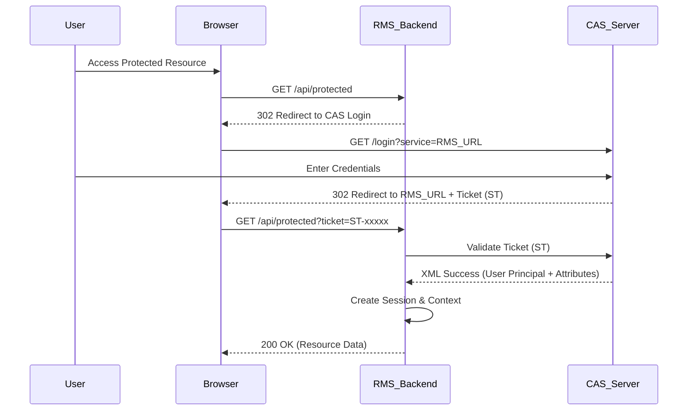

# CAS Single Sign-On (SSO) Integration Practice

## 1. Overview

This document details the Single Sign-On (SSO) integration practice for the **Resource Management System (RMS)**. The system utilizes the **Central Authentication Service (CAS)** protocol to provide secure, unified access control. By offloading authentication to a trusted identity provider, RMS focuses on fine-grained authorization (Role-Based Access Control) and business logic.

### 1.1 Objectives
*   **Unified Authentication**: Users sign in once via the enterprise CAS portal and gain access to RMS.
*   **Security**: Leverage industry-standard ticket validation mechanisms to prevent unauthorized access.
*   **Seamless Experience**: Automatic redirection for unauthenticated requests.
*   **Role Mapping**: Map enterprise identity attributes (LDAP/Active Directory) to local application roles (Admin, Teacher, User).

### 1.2 Technology Stack
*   **Protocol**: CAS 2.0/3.0
*   **Client Library**: `org.jasig.cas.client:cas-client-core:3.2.1`
*   **Backend Framework**: Spring Boot 2.6.4
*   **Frontend Integration**: Vue.js + Axios Interceptors

---

## 2. Architecture & Data Flow

The authentication flow follows the standard CAS proxy ticket validation pattern:



---

## 3. Backend Implementation Details

### 3.1 Dependencies
The project uses the official CAS client for Java.
*File: `pom.xml`*
```xml
<dependency>
    <groupId>org.jasig.cas.client</groupId>
    <artifactId>cas-client-core</artifactId>
    <version>3.2.1</version>
</dependency>
```

### 3.2 Configuration Strategy
Configuration is externalized via `application.yml` and mapped to a Java Bean for type safety.

*File: `application.yml`*
```yaml
cas:
  server-url: ${RMS_CAS_SERVER:https://authserver.swufe.edu.cn/authserver} # The Identity Provider
  service-name: ${RMS_SERVICE_URL:http://localhost:8080} # The Application URL
  teacher-member: ${RMS_CAS_TEACHER_MEMBER:cn=JZG,ou=Groups,dc=swufe,dc=edu,dc=cn} # Role mapping attribute
```

*File: `config/CasConfiguration.java`*
Maps the yaml properties to a Spring component for injection into filters.

### 3.3 Filter Chain Configuration
Security is enforced via a chain of standard Servlet filters, configured in `FilterConfig.java`. Order is critical.

| Order | Filter | Class | Responsibility |
| :--- | :--- | :--- | :--- |
| **100** | **AuthenticationFilter** | `AuthenticationFilter` | Detects unauthenticated users accessing protected paths (e.g., `/caslogin`) and redirects them to the CAS Login page. |
| **200** | **ValidationFilter** | `Cas20ProxyReceivingTicketValidationFilter` | Intercepts incoming requests with a `ticket` parameter. Contacts the CAS server to validate the ticket. If valid, retrieves the user Principal. |
| **300** | **WrapperFilter** | `HttpServletRequestWrapperFilter` | Wraps the `HttpServletRequest` so that `request.getUserPrincipal()` returns the CAS-authenticated user. |

### 3.4 Identity Adaptation & Role Mapping
The `MemberAdapter` class acts as an anti-corruption layer, translating external CAS attributes into internal domain concepts.

*   **Principal Extraction**: Uses `request.getUserPrincipal()` to get the `AttributePrincipal`.
*   **Attribute Mapping**:
    *   `uid` -> User Code
    *   `cn` -> User Name
*   **Role Logic**:
    *   **Admin**: Checks if `uid` exists in the system setting `ADMIN_UIDS`.
    *   **Teacher**: Checks if the user possesses the specific group attribute configured in `cas.teacher-member`.

### 3.5 Fine-Grained Authorization (Interceptor)
While Filters handle *Authentication* (Who are you?), the Interceptor handles *Authorization* (What can you do?).

*File: `identity/AuthenticationInterceptor.java`*
*   **Mechanism**: Spring MVC `HandlerInterceptor`.
*   **Annotation**: `@AuthRequired` used on Controllers or Methods.
*   **Logic**:
    1.  Check if target method needs auth (`@AuthRequired`).
    2.  Retrieve current user via `MemberAdapter`.
    3.  If no user -> **401 Unauthorized**.
    4.  If user exists but lacks Admin role (when `areAdmin=true`) -> **403 Forbidden**.

---

## 4. Frontend Integration (Vue.js)

The frontend is loosely coupled but aware of the authentication state via HTTP status codes.

1.  **Detection**: The Axios response interceptor globally monitors for `401` status codes.
2.  **Redirection**:
    *   Upon receiving a 401, the frontend redirects the browser window to the backend's `/caslogin` endpoint.
    *   Example: `window.location.href = process.env.VUE_APP_API_BASE + '/caslogin';`
3.  **Session Recovery**: After the CAS dance, the browser returns to the app. The backend session is established, and the frontend reloads.

---

## 5. Security & Performance Indicators

### 5.1 Security Requirements
*   **Ticket Validation**: Ensures that the `ticket` parameter cannot be forged or replayed. The `Cas20ProxyReceivingTicketValidationFilter` handles this strictly.
*   **Session Management**: A server-side session (JSESSIONID) is created upon successful validation.
*   **Logout Security**:
    *   Local Logout: `session.invalidate()` destroys the local session.
    *   Global Logout: Redirects to `casServerUrl + "/logout"` to destroy the SSO session (Single Sign-Out).

### 5.2 Performance Considerations
*   **Session Caching**: User attributes are stored in the Session, avoiding repeated round-trips to the CAS server for every request. Ticket validation only happens once per session.
*   **Role Caching**: The list of Admin UIDs is cached (via `IAppSettingService`'s caching mechanism) to prevent database hits on every request intercept.
*   **Static Resources**: Filters and Interceptors are explicitly configured to bypass static assets (`/css/**`, `/js/**`, `favicon.ico`) to minimize overhead.

---

## 6. Troubleshooting Guide

| Issue | Probable Cause | Solution |
| :--- | :--- | :--- |
| **Infinite Redirect Loop** | Browser cookies disabled or Session replication issues in clustered env. | Enable cookies; Check `server.servlet.context-path`; Ensure `service-name` matches the callback URL exactly. |
| **403 Forbidden (Even after login)** | User is authenticated but lacks roles. | Check `AppSetting` table for `ADMIN_UIDS`; Verify CAS response attributes match `teacher-member` config. |
| **Validation Failed** | CAS Server cannot reach Backend (Network isolation). | CAS validation requires the CAS Server to be able to make an HTTP request *back* to the App (or strict HTTPS requirements). Ensure network connectivity. |
