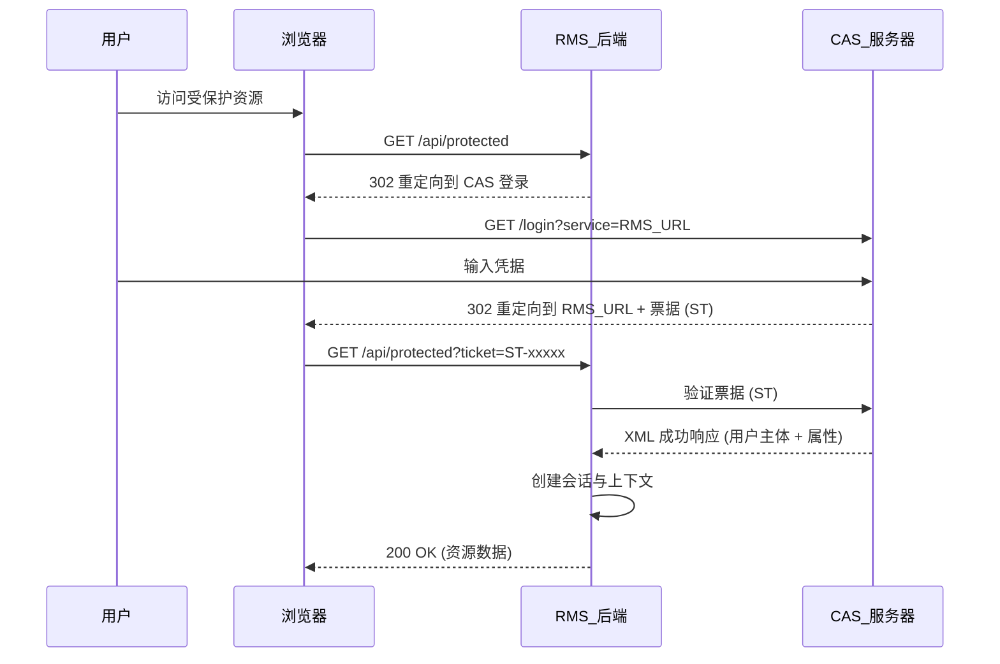

# CAS 单点登录 (SSO) 集成实践

## 1. 概述

本文档详细介绍了 **资源管理系统 (RMS)** 的单点登录 (SSO) 集成实践。系统利用 **CAS (Central Authentication Service)** 协议提供安全、统一的访问控制。通过将身份验证委托给受信任的身份提供者 (Identity Provider)，RMS 专注于细粒度的授权 (基于角色的访问控制 RBAC) 和业务逻辑。

### 1.1 目标
*   **统一认证**：用户通过企业 CAS 门户登录一次即可访问 RMS。
*   **安全性**：利用行业标准的票据 (Ticket) 验证机制防止未授权访问。
*   **无缝体验**：针对未认证请求自动重定向。
*   **角色映射**：将企业身份属性 (LDAP/Active Directory) 映射到本地应用角色 (管理员, 教师, 用户)。

### 1.2 技术栈
*   **协议**: CAS 2.0/3.0
*   **客户端库**: `org.jasig.cas.client:cas-client-core:3.2.1`
*   **后端框架**: Spring Boot 2.6.4
*   **前端集成**: Vue.js + Axios 拦截器 (Interceptors)

---

## 2. 架构与数据流

认证流程遵循标准的 CAS 代理票据验证模式：



---

## 3. 后端实现细节

### 3.1 依赖
项目使用官方的 Java CAS 客户端。
*文件: `pom.xml`*
```xml
<dependency>
    <groupId>org.jasig.cas.client</groupId>
    <artifactId>cas-client-core</artifactId>
    <version>3.2.1</version>
</dependency>
```

### 3.2 配置策略
配置通过 `application.yml` 外部化，并映射到 Java Bean 以确保类型安全。

*文件: `application.yml`*
```yaml
cas:
  server-url: ${RMS_CAS_SERVER:https://authserver.swufe.edu.cn/authserver} # 身份提供者 (The Identity Provider)
  service-name: ${RMS_SERVICE_URL:http://localhost:8080} # 应用 URL (The Application URL)
  teacher-member: ${RMS_CAS_TEACHER_MEMBER:cn=JZG,ou=Groups,dc=swufe,dc=edu,dc=cn} # 角色映射属性 (Role mapping attribute)
```

*文件: `config/CasConfiguration.java`*
将 YAML 属性映射到 Spring 组件以注入过滤器。

### 3.3 过滤器链配置
安全性通过一系列标准的 Servlet 过滤器强制执行，配置在 `FilterConfig.java` 中。顺序至关重要。

| 顺序 | 过滤器 | 类 | 职责 |
| :--- | :--- | :--- | :--- |
| **100** | **AuthenticationFilter** | `AuthenticationFilter` | 检测访问受保护路径 (如 `/caslogin`) 的未认证用户，并将其重定向到 CAS 登录页面。 |
| **200** | **ValidationFilter** | `Cas20ProxyReceivingTicketValidationFilter` | 拦截带有 `ticket` 参数的传入请求。联系 CAS 服务器验证票据。如果有效，检索用户主体 (Principal)。 |
| **300** | **WrapperFilter** | `HttpServletRequestWrapperFilter` | 包装 `HttpServletRequest`，以便 `request.getUserPrincipal()` 返回 CAS 认证的用户。 |

### 3.4 身份适配与角色映射
`MemberAdapter` 类充当防腐层 (Anti-Corruption Layer)，将外部 CAS 属性转换为内部领域概念。

*   **主体提取**: 使用 `request.getUserPrincipal()` 获取 `AttributePrincipal`。
*   **属性映射**:
    *   `uid` -> 用户代码
    *   `cn` -> 用户姓名
*   **角色逻辑**:
    *   **管理员**: 检查 `uid` 是否存在于系统设置 `ADMIN_UIDS` 中。
    *   **教师**: 检查用户是否拥有 `cas.teacher-member` 中配置的特定组属性。

### 3.5 细粒度授权 (拦截器)
过滤器处理 **认证 (Authentication)** (你是谁？)，而拦截器处理 **授权 (Authorization)** (你能做什么？)。

*文件: `identity/AuthenticationInterceptor.java`*
*   **机制**: Spring MVC `HandlerInterceptor`.
*   **注解**: `@AuthRequired` 用于控制器或方法。
*   **逻辑**:
    1.  检查目标方法是否需要认证 (`@AuthRequired`)。
    2.  通过 `MemberAdapter` 获取当前用户。
    3.  如果没有用户 -> **401 未授权 (Unauthorized)**。
    4.  如果用户存在但缺少管理员角色 (当 `areAdmin=true` 时) -> **403 禁止访问 (Forbidden)**。

---

## 4. 前端集成 (Vue.js)

前端通过 HTTP 状态码感知认证状态，保持松耦合。

1.  **检测**: Axios 响应拦截器全局监控 `401` 状态码。
2.  **重定向**:
    *   收到 401 后，前端将浏览器窗口重定向到后端的 `/caslogin` 端点。
    *   示例: `window.location.href = process.env.VUE_APP_API_BASE + '/caslogin';`
3.  **会话恢复**: CAS 流程结束后，浏览器返回应用。后端会话建立，前端重新加载。

---

## 5. 安全与性能指标

### 5.1 安全要求
*   **票据验证**: 确保 `ticket` 参数不能被伪造或重放。`Cas20ProxyReceivingTicketValidationFilter` 严格处理此过程。
*   **会话管理**: 验证成功后创建服务器端会话 (JSESSIONID)。
*   **注销安全**:
    *   本地注销: `session.invalidate()` 销毁本地会话。
    *   全局注销: 重定向到 `casServerUrl + "/logout"` 以销毁 SSO 会话 (单点注销)。

### 5.2 性能考量
*   **会话缓存**: 用户属性存储在 Session 中，避免每次请求都往返 CAS 服务器。每个会话仅验证一次票据。
*   **角色缓存**: 管理员 UID 列表被缓存 (通过 `IAppSettingService` 的缓存机制)，以防止每次请求拦截时都查询数据库。
*   **静态资源**: 过滤器和拦截器明确配置为绕过静态资源 (`/css/**`, `/js/**`, `favicon.ico`) 以最小化开销。

---

## 6. 故障排除指南

| 问题 | 可能原因 | 解决方案 |
| :--- | :--- | :--- |
| **无限重定向循环** | 浏览器 Cookie 被禁用或集群环境中的会话复制问题。 | 启用 Cookie；检查 `server.servlet.context-path`；确保 `service-name` 与回调 URL 完全匹配。 |
| **403 禁止访问 (即使登录后)** | 用户已认证但缺少角色。 | 检查 `AppSetting` 表中的 `ADMIN_UIDS`；验证 CAS 响应属性是否匹配 `teacher-member` 配置。 |
| **验证失败** | CAS 服务器无法访问后端 (网络隔离)。 | CAS 验证要求 CAS 服务器能够向应用发起 HTTP 请求 *回调* (或严格的 HTTPS 要求)。确保网络连通性。 |
