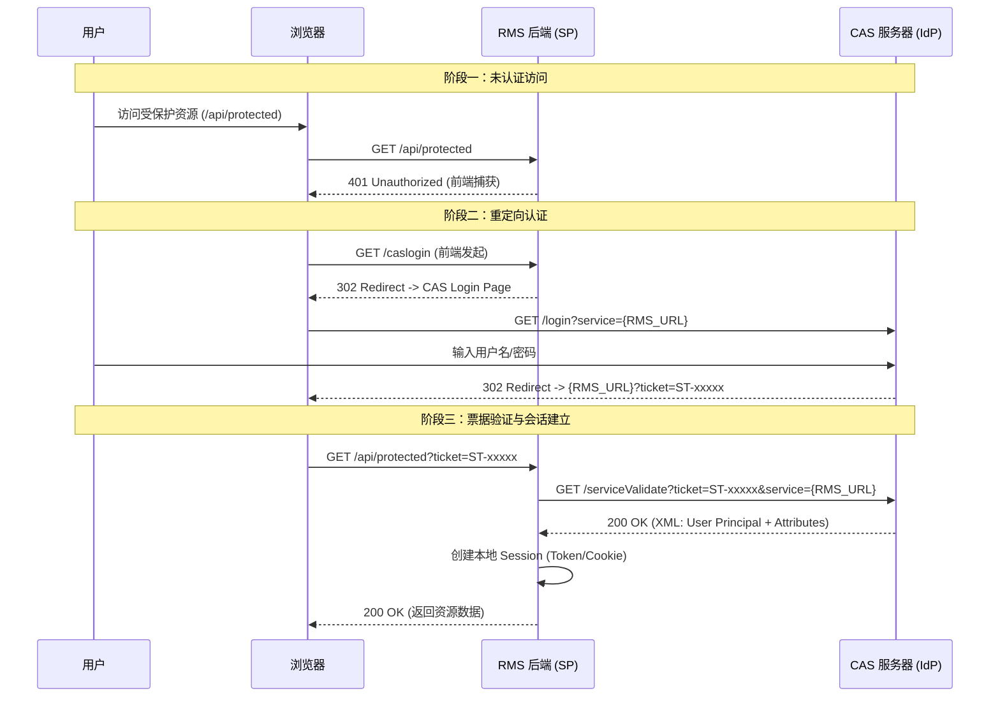

# RMS 单点登录 (SSO) 标准化对接技术参考文档

| 文档版本 | 修改日期 | 修改人 | 修改描述 |
| :--- | :--- | :--- | :--- |
| v1.0.0 | 2025-12-11 | 系统架构组 | 初始版本发布，基于 CAS 2.0/3.0 协议 |
| v1.1.0 | 2025-12-11 | 系统架构组 | 移除特定语言依赖，通用化对接规范 |

---

## 1. 系统概述

### 1.1 简介
本文档旨在规范 **资源管理系统 (RMS)** 与企业级身份认证中心 (CAS Server) 的对接流程。RMS 采用 **CAS (Central Authentication Service)** 协议实现统一身份认证，通过委托认证模式，实现"一处登录，全网通行"的用户体验。

### 1.2 架构说明
系统采用前后端分离架构，SSO 集成主要涉及以下组件：
*   **身份提供者 (IdP)**: 企业 CAS 服务器，负责用户凭据校验和票据签发。
*   **服务提供者 (SP)**: RMS 后端 (REST API)，负责票据验证和会话创建。
*   **客户端**: RMS 前端 (Web/Mobile)，负责处理重定向和状态感知。

### 1.3 技术协议栈
本对接方案不限制后端开发语言，只需满足以下协议标准：
*   **认证协议**: CAS 2.0 / 3.0 Standard
*   **传输协议**: HTTP/1.1 (推荐 HTTPS)
*   **数据格式**: XML / JSON (用于票据验证响应)

---

## 2. 对接前提

在开始集成前，请确保满足以下技术要求：

### 2.1 网络要求
*   **连通性**: RMS 服务器必须能够通过 HTTPS 访问 CAS 服务器地址。
*   **回调能力**: CAS 服务器必须能够通过 HTTP/HTTPS 访问 RMS 服务器的回调地址 (用于 Proxy 模式或 SLO)。

### 2.2 配置准备
需向系统管理员申请以下配置参数 (以环境变量为例)：

| 参数项 | 说明 | 示例值 |
| :--- | :--- | :--- |
| `RMS_CAS_SERVER_URL` | CAS 服务器基础 URL | `https://authserver.swufe.edu.cn/authserver` |
| `RMS_SERVICE_URL` | 本地应用回调 URL | `http://localhost:8080` (开发环境) |
| `RMS_ROLE_MAPPING_ATTR` | 角色映射的属性名 | `memberOf` 或 `ou` |

---

## 3. 详细对接指南

### 3.1 认证流程 (Sequence Diagram)

本系统遵循标准 CAS 协议流程，具体时序如下：



### 3.2 客户端实现模式 (Implementation Patterns)

无论使用何种编程语言 (Java, Python, Go, Node.js)，实现 CAS 客户端通常需要以下三个核心中间件/拦截器：

1.  **Authentication Handler (认证处理器)**
    *   **职责**: 保护受限路由。
    *   **逻辑**: 检查请求是否包含有效会话。如果未认证，返回 `401 Unauthorized` 或直接重定向到 CAS 登录页 (取决于是否为前后端分离)。
    
2.  **Ticket Validator (票据验证器)**
    *   **职责**: 处理 CAS 回调。
    *   **逻辑**: 拦截带有 `ticket` 参数的请求，向 CAS 服务器的 `/serviceValidate` 接口发起 HTTP GET 请求。
    *   **验证 URL 示例**: `${CAS_SERVER}/serviceValidate?ticket=${ST}&service=${SERVICE_URL}`
    *   **成功处理**: 解析返回的 XML，提取 `<cas:user>` 和 `<cas:attributes>`，并建立本地会话。

3.  **User Context Wrapper (用户上下文包装器)**
    *   **职责**: 提供统一的用户信息访问接口。
    *   **逻辑**: 将验证后的用户信息注入到当前的 Request Context 或 ThreadLocal 中，供业务逻辑使用。

### 3.3 接口规范 (OpenAPI 3.0)

以下定义了 SSO 集成相关的关键接口。

```yaml
openapi: 3.0.0
info:
  title: RMS SSO Auth API
  version: 1.0.0
paths:
  /caslogin:
    get:
      summary: 发起 SSO 登录
      description: 前端检测到 401 状态或用户点击登录时调用。
      responses:
        '302':
          description: 重定向到 CAS 服务器登录页面
          headers:
            Location:
              schema:
                type: string
                example: https://authserver.swufe.edu.cn/authserver/login?service=http://localhost:8080
  
  /logout:
    get:
      summary: 发起注销
      description: 销毁本地会话并重定向到 CAS 注销页面。
      responses:
        '302':
          description: 重定向到 CAS 全局注销地址
          headers:
            Location:
              schema:
                type: string
                example: https://authserver.swufe.edu.cn/authserver/logout

  /api/protected:
    get:
      summary: 受保护资源示例
      security:
        - sessionAuth: []
      responses:
        '200':
          description: 成功获取数据
        '401':
          description: 未认证，需跳转登录
        '403':
          description: 已认证但无权限 (如非管理员访问管理接口)
components:
  securitySchemes:
    sessionAuth:
      type: apiKey
      in: cookie
      name: JSESSIONID
      description: 或使用 Authorization Header (Bearer Token)
```

### 3.4 加密算法与密钥管理

::: danger 安全警告
*   **传输安全**: 所有与 CAS 服务器的通信 **必须** 通过 HTTPS 进行。
*   **票据安全**: Service Ticket (ST) 是一次性的，使用后即失效。
:::

*   **SSL/TLS**: 服务端需配置受信任的 SSL 证书链，确保能正确验证 CAS 服务器证书。
*   **敏感信息**: 生产环境建议使用 HashiCorp Vault 或 Kubernetes Secrets 管理敏感配置。

### 3.5 错误代码与异常处理机制

系统定义了以下标准认证/授权错误码：

| HTTP 状态码 | 内部错误码 | 描述 | 处理建议 |
| :--- | :--- | :--- | :--- |
| **401** | `AUTH_REQUIRED` | 未检测到有效会话或 Ticket 无效 | 前端拦截器捕获，重定向至 `/caslogin` |
| **403** | `PERMISSION_DENIED` | 用户已认证，但角色权限不足 | 提示"无权访问"，检查用户角色映射配置 |
| **500** | `CAS_VALIDATION_ERROR` | CAS 票据校验失败 (如网络超时、格式错误) | 检查后端日志，验证 CAS 服务器连通性 |

---

## 4. 测试验证方案

### 4.1 测试用例设计

| ID | 测试场景 | 前置条件 | 操作步骤 | 预期结果 |
| :--- | :--- | :--- | :--- | :--- |
| TC-001 | 正常登录 | 无会话 | 1. 访问受保护页面<br>2. 跳转 CAS 登录<br>3. 输入正确凭据 | 成功跳转回原页面，显示用户数据 |
| TC-002 | 未授权访问 | 无会话 | 1. 直接调用 API 接口 | 返回 401 状态码 |
| TC-003 | 权限不足 | 普通用户登录 | 1. 访问管理员专用接口 | 返回 403 状态码 |
| TC-004 | 会话超时 | 会话过期 | 1. 刷新页面或发起请求 | 返回 401，重新触发登录流程 |
| TC-005 | 单点注销 | 已登录 | 1. 访问 `/logout` | 本地 Session 销毁，跳转至 CAS 注销页 |

### 4.2 常见问题排查指南 (Troubleshooting)

1.  **无限重定向循环**
    *   **现象**: 浏览器地址栏在 RMS 和 CAS 之间快速闪烁。
    *   **原因**: 浏览器禁用了 Cookie，或 `service` 参数与实际回调地址不匹配。
    *   **排查**: 检查后端配置的 Service URL，确保其与浏览器访问地址完全一致 (包括 Scheme, Host, Port)。

2.  **403 Forbidden 误报**
    *   **现象**: 用户明明是管理员，却无法访问管理后台。
    *   **原因**: 角色/组映射失败。
    *   **排查**: 检查用户 UID 是否在管理员白名单中；检查 CAS 返回的 XML 属性中是否包含预期的 Group 信息。

3.  **票据校验失败 (Ticket Validation Failed)**
    *   **现象**: 后端日志显示票据校验请求超时或失败。
    *   **原因**: 服务器无法回调 CAS 服务器（DNS 解析错误、防火墙拦截、SSL 握手失败）。
    *   **排查**: 在后端服务器执行 `curl -v https://cas-server/login` 验证网络连通性。

---

## 5. 附录

### 5.1 Postman 测试集合
配套的测试集合文件 `sso_postman_collection.json` 已随文档归档。请导入 Postman 使用。

### 5.2 参考资源
*   [CAS Protocol Specification](https://apereo.github.io/cas/6.6.x/protocol/CAS-Protocol.html)
*   [Python CAS Client (django-cas-ng)](https://github.com/django-cas-ng/django-cas-ng)
*   [Node.js CAS Client (connect-cas)](https://github.com/aceofclubs/connect-cas)
*   [Go CAS Client (gocas)](https://github.com/go-cas/cas)
